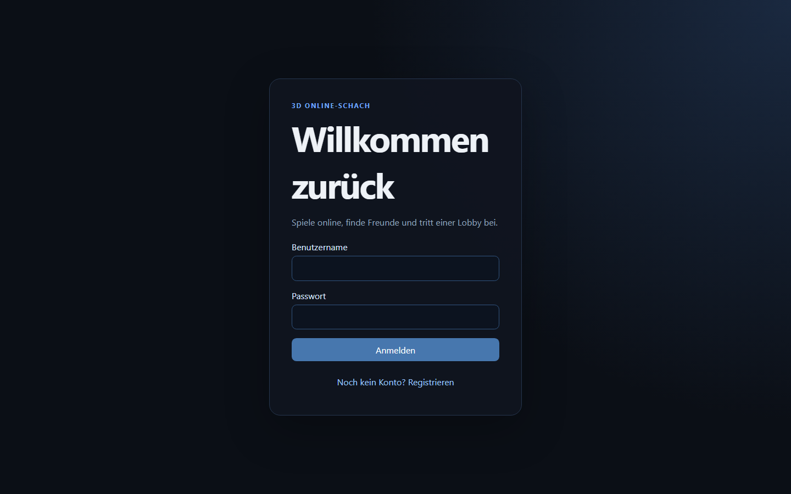
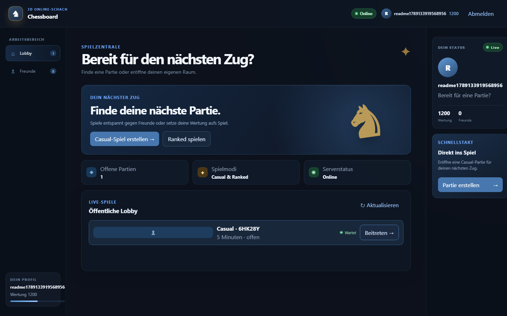
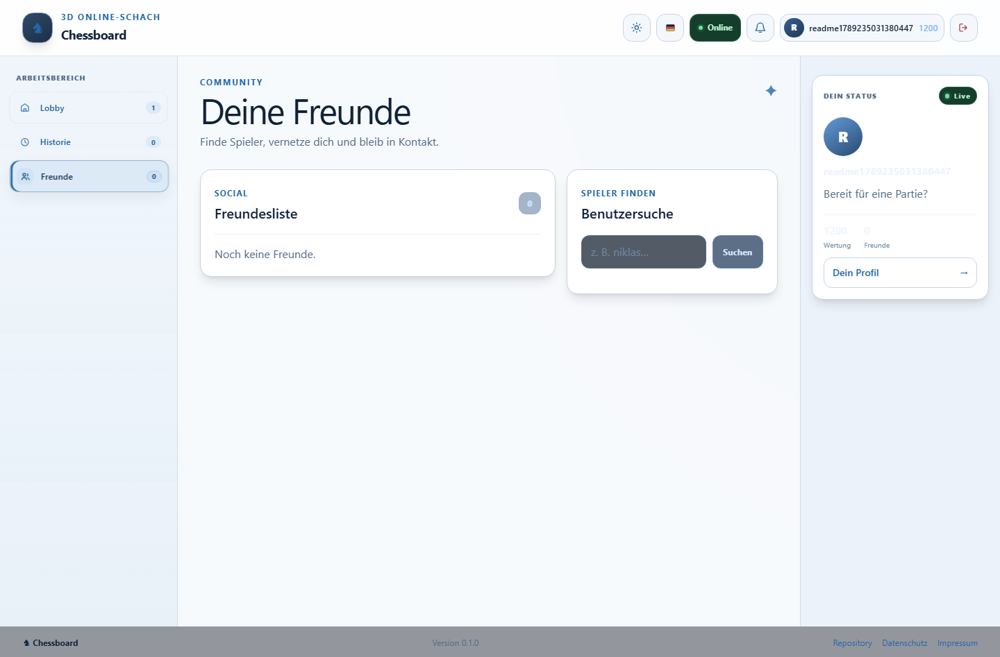
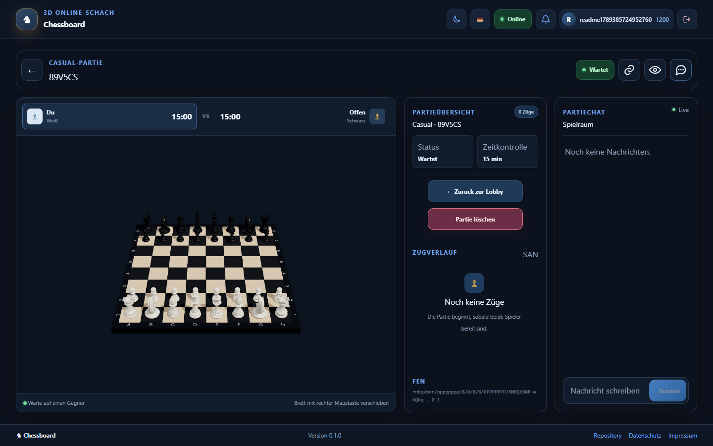

# 3D Online-Schach

Browserbasierte 3D-Schachplattform mit React, Tailwind CSS v4, Three.js, Fastify, Socket.IO, PostgreSQL und Prisma.

## Frontend-Styling

Tailwind CSS v4 wird über das offizielle Vite-Plugin eingebunden. Die Design-Tokens liegen in `apps/client/src/styles.css`; bestehende Komponentenstyles werden während der schrittweisen Migration in einer Tailwind-Component-Layer gehalten. Neue UI-Komponenten verwenden Tailwind-Utilities direkt.

Die React-Oberfläche ist nach fachlichen Modulen aufgeteilt. `apps/client/src/App.tsx` übernimmt nur noch Routing und Zustandsübergänge zwischen Lade-, Auth-, Zuschauer- und eingeloggter Ansicht. Der Hook `apps/client/src/app/useAppController.ts` kapselt API-, Socket-, Lobby-, Chat- und Spielzustand; die Darstellungs-Module liegen unter `apps/client/src/components/app/`. Gemeinsame Typen und reine Hilfsfunktionen befinden sich unter `apps/client/src/app/`.

## Aktueller Stand

Der Multiplayer-MVP ist umgesetzt:

- 3D-Schachbrett mit sechs unterscheidbaren, in Blender erzeugten Figurenmodellen
- FEN-gesteuerte Figurenpositionen mit animierten Zügen, Kamera und Auswahl
- lokale Schachregeln mit `chess.js`
- private Online-Spielräume über Game-Codes
- lokale Konten mit Session-Cookies, Login und Registrierung
- öffentliche Lobby mit Casual-/Ranked-Spielen
- Benutzersuche, Online-Präsenz und Freundschaftsanfragen
- Benachrichtigungen für Freundschafts- und Spieleinladungen
- teilbare Partienlinks über `/game/:code` und lesende Zuschauerlinks über `/watch/:code`
- Partiechat für Teilnehmer mit historischer Speicherung und Live-Broadcast
- serverseitige Zugvalidierung und Socket.IO-Synchronisierung inklusive automatischem Join-Update
- responsiver Spielmodus, der das 3D-Brett auf der verfügbaren Browserfläche maximiert
- Spieluhr, Timeout, Reconnect und State-Sync
- Prisma-Persistenz für Games, Moves, FEN, Uhrwerte und Ergebnisse
- versionierte PostgreSQL-Migrationen für Games, Sessions und soziale Beziehungen
- responsiver Footer mit Version, Repository-, Datenschutz- und Impressum-Links auf Deutsch und Englisch
- zentrale Anwendungsversion für Client-Footer und Server-Health-Endpunkt

PGN-Export und ladbare Spielhistorie sind bereits über die Server-API verfügbar.

## Produktansichten

Die wichtigsten Oberflächen im aktuellen Stand:

<p>
  
  
</p>
<p>
  
  
</p>

Die Screenshots können mit laufendem Client, Server und PostgreSQL neu erzeugt werden:

```bash
pnpm docs:screenshots
```

## Voraussetzungen

- Node.js
- pnpm 11
- Docker Desktop für PostgreSQL
- Blender 5.1 oder neuer, nur zum Neuerzeugen der mitgelieferten 3D-Modelle

## Entwicklung starten

Abhängigkeiten installieren:

```bash
pnpm install
```

PostgreSQL starten:

```bash
docker compose up -d postgres
```

Für die lokale Entwicklung nutzt der Server standardmäßig `DATABASE_URL` auf die PostgreSQL-Instanz. Vor dem Start müssen die Datenbankmigrationen angewendet und der Prisma Client erzeugt werden.

Prisma Client generieren und Migration ausführen:

```bash
pnpm --filter @chess3d/server db:generate
pnpm --filter @chess3d/server exec prisma migrate deploy
```

Danach Client und Server mit den vorhandenen Workspace-Skripten starten:

```bash
pnpm dev
```

Die lokale Datenbankverbindung wird über `DATABASE_URL` konfiguriert. Eine Vorlage liegt in [.env.example](.env.example).

## Versionierung und Release

Die einzige Versionsquelle liegt in [packages/shared/src/version.ts](packages/shared/src/version.ts). Der Wert wird im Client-Footer angezeigt und über `GET /health` als `version` zurückgegeben.

Für einen Release-Schritt wird die Version zentral aktualisiert:

```bash
pnpm version:set 0.2.0
pnpm typecheck
pnpm test
pnpm build
```

Der Befehl akzeptiert ausschließlich `major.minor.patch`-Versionen. Anschließend kann der Commit als Release-Grundlage getaggt werden.

## Spielhistorie und PGN

Gespeicherte Partien und ihre Züge können über die Server-API geladen werden:

```text
GET /games/:code/history  # Spiel, FEN und Move-Historie als JSON
GET /games/:code/pgn      # vollständige Partie als PGN-Download
```

Der PGN-Export enthält Spieler- und Ergebnis-Header und kann wieder in den Chess-Core eingelesen werden.

## Multiplayer-API

Der Client verwendet serverseitige Session-Cookies (`chess3d_session`) und sendet Requests mit Credentials:

```text
POST /auth/register       # Konto erstellen
POST /auth/login          # Session starten
GET  /auth/me             # aktuelles Konto
GET  /lobby               # wartende öffentliche Partien
POST /lobby/games         # Casual- oder Ranked-Partie erstellen
POST /lobby/games/:code/join
GET  /users/search?q=...  # Benutzer suchen
GET  /friends             # Freunde sowie eingehende/ausgehende Anfragen
POST /friends/requests
POST /friends/requests/:id/accept|reject|cancel
GET  /notifications         # Benachrichtigungen des Kontos
POST /notifications/:id/read
GET  /games/:code/chat      # gespeicherte Partienachrichten laden
POST /games/:code/chat      # Nachricht als Teilnehmer senden
GET  /games/:code/spectate  # initialen Spielstand für Zuschauer laden
GET  /health                # Serverstatus und Anwendungsversion
```

Die Echtzeit-Partie läuft über Socket.IO. Authentifizierte Browser verbinden sich mit `withCredentials`; der Server prüft das Session-Cookie vor dem Beitritt zu einem Spielraum. Teilnehmer verwenden `game:sync`, Zuschauer `game:spectate`; beide erhalten `move:accepted` und Chatnachrichten live. Ein Join über die REST-Lobby löst zusätzlich ein `game:updated` für bereits verbundene Teilnehmer aus.

## 3D-Figuren neu erzeugen

Die fertigen GLB-Dateien liegen unter `apps/client/public/models/chess` und werden direkt mitgeliefert. Nach Änderungen am Generator können sie mit Blender neu gebaut werden:

```bash
blender --background --python scripts/blender/generate_chess_pieces.py
```

## 3D-Brett bedienen

- Linke Maustaste: Kamera drehen und Figuren/Felder auswählen
- Mittlere Maustaste: zoomen
- Rechte Maustaste: Brett verschieben

Die Kamerabewegung ist auf einen Bereich rund um das Schachbrett begrenzt.

## Qualitätssicherung

```bash
pnpm typecheck
pnpm test
pnpm test:e2e
pnpm test:coverage
pnpm lint
pnpm build
```

`pnpm test:coverage` erzeugt für Client, Server und Packages jeweils `coverage/lcov.info`.

Die Authentifizierungs-Flows werden zusätzlich mit Playwright in einem echten Chromium-Browser geprüft:

- Registrierung inklusive optionaler E-Mail
- Session-Wiederherstellung nach einem Reload
- Login mit korrekten und falschen Zugangsdaten
- doppelte Registrierung
- Abmeldung inklusive gelöschtem Session-Cookie
- Browser-Validierung für zu kurze Passwörter
- Zwei-Spieler-Einladung mit Chatnachricht und drittem Zuschauer
- responsives 3D-Brett inklusive Resize auf 640px Breite

Der E2E-Lauf startet bei Bedarf Client und Server selbst. Für den Server wird eine laufende PostgreSQL-Instanz mit angewendeten Prisma-Migrationen benötigt.

```bash
pnpm test:e2e
```

Die SonarQube-Konfiguration liest diese Reports automatisch ein. Die WebGL-Renderfläche
(`ChessScene.tsx`) und der reine Vite-Einstieg (`main.tsx`) sind als Browser-/Rendering-
Integrationsgrenzen aus der Coverage-Kennzahl ausgenommen; die fachliche Client-Logik
bleibt testpflichtig. Für eine Analyse mit Quality Gate wird ein gültiger `SONAR_TOKEN`
benötigt:

```powershell
.\sonar.ps1 -SonarHostUrl "http://sonarqube:9000" -Token $env:SONAR_TOKEN -ProjectKey "3D-Online-Schach"
```

Die beiden R3F-Dateien enthalten gültige React-Three-Fiber-Intrinsic-Properties.
Da der Sonar-TypeScript-Analyzer diese JSX-Erweiterungen nicht erkennt, ist nur die
Regel `typescript:S6747` für diese beiden Renderflächen gezielt ausgenommen.

## Projektstruktur

```text
apps/client              React-, Vite- und 3D-Frontend
apps/server              Fastify-, Socket.IO- und Prisma-Backend
apps/server/prisma       Prisma-Schema und Datenbankmigrationen
packages/chess-core      Schachregeln und Chess-State
packages/shared          Gemeinsame Typen und Verträge
scripts/blender          Reproduzierbarer Generator für die GLB-Figuren
```

Die ausführliche Planung steht in [3d_online_schach_roadmap.md](3d_online_schach_roadmap.md). GitHub-Milestones und Tickets sind die aktive Arbeitsliste.

Die Plattformbegriffe stehen in [CONTEXT.md](CONTEXT.md); langfristige Entscheidungen sind unter [docs/adr](docs/adr) dokumentiert.
